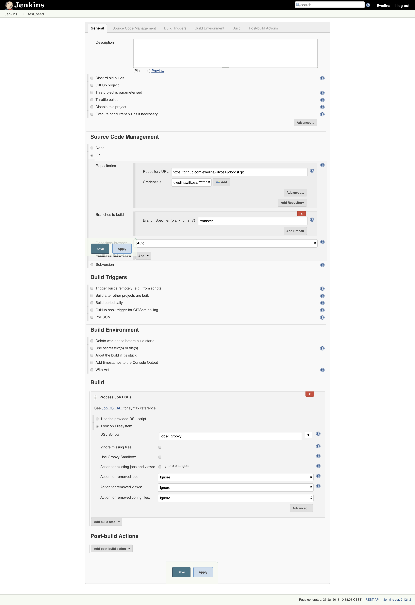

# jobddsl

## Getting Started

**Install Job DSL plugin** on your Jenkins - API will be available at [http://localhost:8080/plugin/job-dsl/api-viewer/index.html](http://localhost:8080/plugin/job-dsl/api-viewer/index.html)

**Create credentials** in Jenkins
Credentials -> System -> Global credentials -> Add Credentials

Kind: username with password (use your github username and password)

**Disable script security**
Manage Jenkins -> Configure Global Security
uncheck `Enable script security for Job DSL scripts`

**Create a seed job** like the one below and run it once ready.
New item -> Enter an item name -> Freestyle project -> OK

